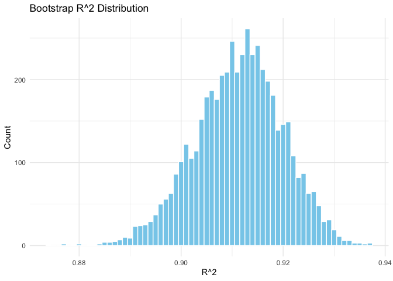
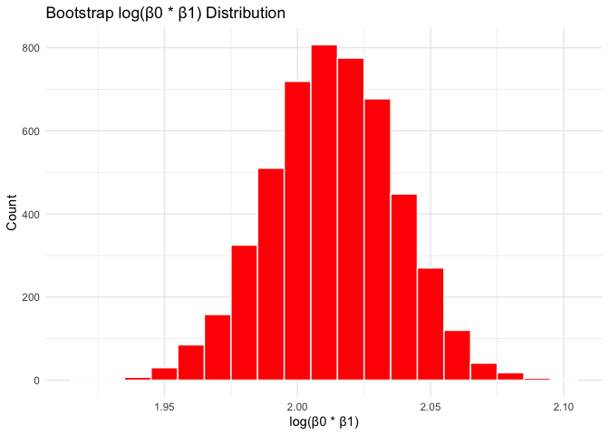

p8105_hw6_ms6826
================
2024-11-25

## Problem 1

``` r
weather_df = 
  rnoaa::meteo_pull_monitors(
    c("USW00094728"),
    var = c("PRCP", "TMIN", "TMAX"), 
    date_min = "2017-01-01",
    date_max = "2017-12-31") %>%
  mutate(
    name = recode(id, USW00094728 = "CentralPark_NY"),
    tmin = tmin / 10,
    tmax = tmax / 10) %>%
  select(name, id, everything())
```

    ## using cached file: /Users/meredithsteinberg/Library/Caches/org.R-project.R/R/rnoaa/noaa_ghcnd/USW00094728.dly

    ## date created (size, mb): 2024-09-26 10:18:43.767423 (8.651)

    ## file min/max dates: 1869-01-01 / 2024-09-30

Use 5000 bootstrap samples and, for each bootstrap sample, produce
estimates of these two quantities.

``` r
boot_results=
  weather_df |> 
  modelr::bootstrap(5000) |> 
  mutate(
    strap=map(strap, as_tibble),
    models=map(strap,\(df) lm(tmax~tmin, data=df)),
    r_squared = map_dbl(models, \(model) summary(model)$r.squared), 
    beta0 = map_dbl(models, \(model) coef(model)[1]), 
    beta1 = map_dbl(models, \(model) coef(model)[2]), 
    log_beta_product = log(beta0 * beta1) 
  ) |> 
  select(.id, r_squared, log_beta_product)

boot_results
```

    ## # A tibble: 5,000 × 3
    ##    .id   r_squared log_beta_product
    ##    <chr>     <dbl>            <dbl>
    ##  1 0001      0.907             2.04
    ##  2 0002      0.896             2.03
    ##  3 0003      0.918             2.05
    ##  4 0004      0.899             2.07
    ##  5 0005      0.913             1.97
    ##  6 0006      0.919             1.99
    ##  7 0007      0.918             2.00
    ##  8 0008      0.907             2.00
    ##  9 0009      0.916             2.01
    ## 10 0010      0.918             2.02
    ## # ℹ 4,990 more rows

Plot the distribution of your estimates, and describe these in words.

``` r
boot_results |> 
  ggplot(aes(x=r_squared))+
  geom_histogram(binwidth = 0.001, fill = "skyblue", color = "white") +
  labs(title = "Bootstrap R^2 Distribution", x = "R^2", y = "Count") +
  theme_minimal()
```

<!-- -->

``` r
boot_results |> 
  ggplot(aes(x=log_beta_product))+
  geom_histogram(binwidth = 0.01, fill = "red", color = "white") +
  labs(title = "Bootstrap log(β0 * β1) Distribution", x = "log(β0 * β1)", y = "Count") +
  theme_minimal()
```

<!-- -->
—The distribution of R^2 appears to be relatively normal, with its
center around ~0.913. The distribution of log(β0 \* β1) also appears to
be normal, with its center closer to 2.01.

Using the 5000 bootstrap estimates, identify the 2.5% and 97.5%
quantiles to provide a 95% confidence interval

``` r
boot_results |> 
  summarize(
    rsq_ci_ll=quantile(r_squared, 0.025),
    rsq_ci_ul=quantile(r_squared, 0.975),
    logp_ci_ll=quantile(log_beta_product, 0.025),
    logp_ci_ul=quantile(log_beta_product, 0.975),
  ) 
```

    ## # A tibble: 1 × 4
    ##   rsq_ci_ll rsq_ci_ul logp_ci_ll logp_ci_ul
    ##       <dbl>     <dbl>      <dbl>      <dbl>
    ## 1     0.894     0.927       1.96       2.06

—The 95% confidence interval for r^2 is (0.894, 0.927) and the 95%
confidence interval for log(β0 \* β1) is (1.96, 2.06).
