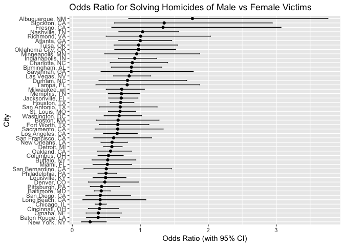

p8105_hw6_ms6826
================
2024-11-25

## Problem 1

``` r
weather_df = 
  rnoaa::meteo_pull_monitors(
    c("USW00094728"),
    var = c("PRCP", "TMIN", "TMAX"), 
    date_min = "2017-01-01",
    date_max = "2017-12-31") %>%
  mutate(
    name = recode(id, USW00094728 = "CentralPark_NY"),
    tmin = tmin / 10,
    tmax = tmax / 10) %>%
  select(name, id, everything())
```

    ## using cached file: /Users/meredithsteinberg/Library/Caches/org.R-project.R/R/rnoaa/noaa_ghcnd/USW00094728.dly

    ## date created (size, mb): 2024-09-26 10:18:43.767423 (8.651)

    ## file min/max dates: 1869-01-01 / 2024-09-30

Use 5000 bootstrap samples and, for each bootstrap sample, produce
estimates of these two quantities.

``` r
boot_results=
  weather_df |> 
  modelr::bootstrap(5000) |> 
  mutate(
    strap=map(strap, as_tibble),
    models=map(strap,\(df) lm(tmax~tmin, data=df)),
    r_squared = map_dbl(models, \(model) summary(model)$r.squared), 
    beta0 = map_dbl(models, \(model) coef(model)[1]), 
    beta1 = map_dbl(models, \(model) coef(model)[2]), 
    log_beta_product = log(beta0 * beta1) 
  ) |> 
  select(.id, r_squared, log_beta_product)

boot_results
```

    ## # A tibble: 5,000 × 3
    ##    .id   r_squared log_beta_product
    ##    <chr>     <dbl>            <dbl>
    ##  1 0001      0.907             2.04
    ##  2 0002      0.896             2.03
    ##  3 0003      0.918             2.05
    ##  4 0004      0.899             2.07
    ##  5 0005      0.913             1.97
    ##  6 0006      0.919             1.99
    ##  7 0007      0.918             2.00
    ##  8 0008      0.907             2.00
    ##  9 0009      0.916             2.01
    ## 10 0010      0.918             2.02
    ## # ℹ 4,990 more rows

Plot the distribution of your estimates, and describe these in words.

``` r
boot_results |> 
  ggplot(aes(x=r_squared))+
  geom_histogram(binwidth = 0.001, fill = "skyblue", color = "white") +
  labs(title = "Bootstrap R^2 Distribution", x = "R^2", y = "Count") +
  theme_minimal()
```

<!-- -->

``` r
boot_results |> 
  ggplot(aes(x=log_beta_product))+
  geom_histogram(binwidth = 0.01, fill = "red", color = "white") +
  labs(title = "Bootstrap log(β0 * β1) Distribution", x = "log(β0 * β1)", y = "Count") +
  theme_minimal()
```

<!-- -->
—The distribution of r^2 appears to be relatively normal, with its
center around ~0.913. The distribution of log(β0 \* β1) also appears to
be normal, with its center closer to 2.01.

Using the 5000 bootstrap estimates, identify the 2.5% and 97.5%
quantiles to provide a 95% confidence interval

``` r
boot_results |> 
  summarize(
    rsq_ci_ll=quantile(r_squared, 0.025),
    rsq_ci_ul=quantile(r_squared, 0.975),
    logp_ci_ll=quantile(log_beta_product, 0.025),
    logp_ci_ul=quantile(log_beta_product, 0.975),
  ) 
```

    ## # A tibble: 1 × 4
    ##   rsq_ci_ll rsq_ci_ul logp_ci_ll logp_ci_ul
    ##       <dbl>     <dbl>      <dbl>      <dbl>
    ## 1     0.894     0.927       1.96       2.06

—The 95% confidence interval for r^2 is (0.894, 0.927) and the 95%
confidence interval for log(β0 \* β1) is (1.96, 2.06).

## Problem 2

Create a city_state variable (e.g. “Baltimore, MD”), and a binary
variable indicating whether the homicide is solved. Omit cities Dallas,
TX; Phoenix, AZ; and Kansas City, MO – these don’t report victim race.
Also omit Tulsa, AL – this is a data entry mistake. For this problem,
limit your analysis those for whom victim_race is white or black. Be
sure that victim_age is numeric.

``` r
homicide_df=
  read_csv("data/homicide-data.csv") 
```

    ## Rows: 52179 Columns: 12
    ## ── Column specification ────────────────────────────────────────────────────────
    ## Delimiter: ","
    ## chr (9): uid, victim_last, victim_first, victim_race, victim_age, victim_sex...
    ## dbl (3): reported_date, lat, lon
    ## 
    ## ℹ Use `spec()` to retrieve the full column specification for this data.
    ## ℹ Specify the column types or set `show_col_types = FALSE` to quiet this message.

``` r
hom_df=
homicide_df |> 
  mutate(
    city_state=paste(city, state, sep=", "),
    solved = case_when(
      disposition == "Closed without arrest" ~ 0,
      disposition == "Closed by arrest" ~ 1,
      disposition == "Open/No arrest" ~ 0),
    victim_age=as.numeric(victim_age)
    ) |> 
  filter(
    !city_state %in% c("Dallas, TX", "Phoenix, AZ", "Kansas City, MO", "Tulsa, AL"),
    victim_race %in% c("White", "Black")
    ) 
```

    ## Warning: There was 1 warning in `mutate()`.
    ## ℹ In argument: `victim_age = as.numeric(victim_age)`.
    ## Caused by warning:
    ## ! NAs introduced by coercion

For the city of Baltimore, MD, use the glm function to fit a logistic
regression with resolved vs unresolved as the outcome and victim age,
sex and race as predictors. Save the output of glm as an R object; apply
the broom::tidy to this object; and obtain the estimate and confidence
interval of the adjusted odds ratio for solving homicides comparing male
victims to female victims keeping all other variables fixed.

``` r
balt_reg=
hom_df |> 
  filter(city_state=="Baltimore, MD") |> 
  glm(solved~ victim_age + victim_race + victim_sex, data = _, family=binomial()) |> 
  broom::tidy()

balt_reg_notidy=
hom_df |> 
  filter(city_state=="Baltimore, MD") |> 
  glm(solved~ victim_age + victim_race + victim_sex, data = _, family=binomial())

conf_int_exp=confint.default(balt_reg_notidy) |> exp() 

conf_int_exp[4, ]
```

    ##     2.5 %    97.5 % 
    ## 0.3245606 0.5578627

``` r
balt_reg |> 
  filter(term=="victim_sexMale") |> 
  mutate(
    odds_ratio = exp(estimate)
  ) |> 
  pull(odds_ratio)
```

    ## [1] 0.4255117

Now run glm for each of the cities in your dataset, and extract the
adjusted odds ratio (and CI) for solving homicides comparing male
victims to female victims. Do this within a “tidy” pipeline, making use
of purrr::map, list columns, and unnest as necessary to create a
dataframe with estimated ORs and CIs for each city.

``` r
results_df=
  hom_df |> 
  group_by(city_state) |> 
  nest() |> 
  mutate(
    model = map(data, \(x) glm(solved ~ victim_age + victim_race + victim_sex, data=x, family = binomial())),
    tidy_results=map(model, broom::tidy),
    confint_results = map(model, ~ exp(confint.default(.x)))
    ) |> 
 unnest(tidy_results) |>  
  filter(term == "victim_sexMale")  |>   
  mutate(
    odds_ratio = exp(estimate),  
    conf_low = confint_results[[1]][4, 1], 
    conf_high = confint_results[[1]][4, 2]  
  ) |> 
  select(city_state, odds_ratio, conf_low, conf_high) 

print(results_df)
```

    ## # A tibble: 47 × 4
    ## # Groups:   city_state [47]
    ##    city_state      odds_ratio conf_low conf_high
    ##    <chr>                <dbl>    <dbl>     <dbl>
    ##  1 Albuquerque, NM      1.77     0.831     3.76 
    ##  2 Atlanta, GA          1.00     0.684     1.46 
    ##  3 Baltimore, MD        0.426    0.325     0.558
    ##  4 Baton Rouge, LA      0.381    0.209     0.695
    ##  5 Birmingham, AL       0.870    0.574     1.32 
    ##  6 Boston, MA           0.674    0.356     1.28 
    ##  7 Buffalo, NY          0.521    0.290     0.935
    ##  8 Charlotte, NC        0.884    0.557     1.40 
    ##  9 Chicago, IL          0.410    0.336     0.501
    ## 10 Cincinnati, OH       0.400    0.236     0.677
    ## # ℹ 37 more rows

Create a plot that shows the estimated ORs and CIs for each city.
Organize cities according to estimated OR, and comment on the plot. MxS
CANNOT GET THIS TO ORGANIZE BY OR

``` r
results_df |>  
  arrange(odds_ratio) |> 
  mutate(city_state = factor(city_state, levels = city_state)) |> 
  ggplot(aes(x=odds_ratio, y=city_state)) +
  geom_point() +
  geom_errorbar(aes(xmin = conf_low, xmax = conf_high), width = 0.2) +
    labs(
    title = "Odds Ratio for Solving Homicides Comparing Male Victims to Female Victims",
    x = "Odds Ratio (with 95% CI)",
    y = "City"
  )
```

<!-- -->

## Problem 3

Load and clean the data for regression analysis (i.e. convert numeric to
factor where appropriate, check for missing data, etc.).

``` r
bwt_df=
  read_csv("data/birthweight.csv") |> 
  janitor::clean_names() |> 
  mutate(
    babysex=
      case_match(babysex, 
                 1 ~ "male",
                 2 ~ "female"),
    babysex=fct_infreq(babysex),
    frace=
      case_match(frace,
                 1 ~ "white",
                 2 ~ "black",
                 3 ~ "asian",
                 4 ~ "puerto rican",
                 8 ~ "other",
                 9 ~ "unknown"
                  ),
    frace=fct_infreq(frace),
    mrace=
      case_match(mrace,
                 1 ~ "white",
                 2 ~ "black",
                 3 ~ "asian",
                 4 ~ "puerto rican",
                 8 ~ "other"
                  ),
    mrace=fct_infreq(mrace),
    malform=
      case_match(malform,
                 0 ~ "absent",
                 1~ "present"),
    malform=fct_infreq(malform)
  ) 
```

    ## Rows: 4342 Columns: 20
    ## ── Column specification ────────────────────────────────────────────────────────
    ## Delimiter: ","
    ## dbl (20): babysex, bhead, blength, bwt, delwt, fincome, frace, gaweeks, malf...
    ## 
    ## ℹ Use `spec()` to retrieve the full column specification for this data.
    ## ℹ Specify the column types or set `show_col_types = FALSE` to quiet this message.

Propose a regression model for birthweight. This model may be based on a
hypothesized structure for the factors that underly birthweight, on a
data-driven model-building process, or a combination of the two.
Describe your modeling process and show a plot of model residuals
against fitted values – use add_predictions and add_residuals in making
this plot.

Look at data

``` r
bwt_df |> 
  ggplot(aes(x=gaweeks, y=bwt))+
  geom_point(alpha=.5)
```

<!-- -->

``` r
bwt_df |> 
  ggplot(aes(x=momage, y=bwt))+
  geom_point(alpha=.5)
```

<!-- -->

``` r
bwt_df |> 
  ggplot(aes(x=smoken, y=bwt))+
  geom_point(alpha=.5)
```

<!-- -->
Fit some models

``` r
linear_mod_momage=lm(bwt~momage, data=bwt_df)
linear_mod_smoken=lm(bwt~smoken, data=bwt_df)
linear_mod_gaweeks=lm(bwt~gaweeks, data=bwt_df)

pwl_mod_momage=lm(bwt~momage, data=bwt_df)
pwl_mod_smoken=lm(bwt~smoken, data=bwt_df)
pwl_mod_gaweeks=lm(bwt~gaweeks, data=bwt_df)

smooth_mod_momage=gam(bwt~s(momage), data=bwt_df)
smooth_mod_smoken=gam(bwt~s(smoken), data=bwt_df)
smooth_mod_gaweeks=gam(bwt~ s(gaweeks), data=bwt_df)
```

Look at models

``` r
bwt_df |> 
  add_predictions(linear_mod_gaweeks) |>
  ggplot(aes(x=gaweeks, y=bwt))+
  geom_point(alpha=.5) +
  geom_line(aes(y=pred), color="red")
```

<!-- -->

``` r
bwt_df |> 
  add_predictions(pwl_mod_gaweeks) |>
  ggplot(aes(x=gaweeks, y=bwt))+
  geom_point(alpha=.5) +
  geom_line(aes(y=pred), color="red")
```

<!-- -->

``` r
bwt_df |> 
  add_predictions(smooth_mod_gaweeks) |>
  ggplot(aes(x=gaweeks, y=bwt))+
  geom_point(alpha=.5) +
  geom_line(aes(y=pred), color="red")
```

<!-- -->

``` r
bwt_df |> 
  add_predictions(linear_mod_momage) |> 
  ggplot(aes(x=momage, y=bwt))+
  geom_point(alpha=.5) +
  geom_line(aes(y=pred), color="red")
```

<!-- -->

``` r
bwt_df |> 
  add_predictions(pwl_mod_momage) |> 
  ggplot(aes(x=momage, y=bwt))+
  geom_point(alpha=.5) +
  geom_line(aes(y=pred), color="red")
```

<!-- -->

``` r
bwt_df |> 
  add_predictions(smooth_mod_momage) |> 
  ggplot(aes(x=momage, y=bwt))+
  geom_point(alpha=.5) +
  geom_line(aes(y=pred), color="red")
```

<!-- -->

``` r
bwt_df |> 
  add_predictions(linear_mod_smoken) |> 
  ggplot(aes(x=smoken, y=bwt))+
  geom_point(alpha=.5) +
   geom_line(aes(y=pred), color="red")
```

<!-- -->

``` r
bwt_df |> 
  add_predictions(pwl_mod_smoken) |> 
  ggplot(aes(x=smoken, y=bwt))+
  geom_point(alpha=.5) +
   geom_line(aes(y=pred), color="red")
```

<!-- -->

``` r
bwt_df |> 
  add_predictions(smooth_mod_smoken) |> 
  ggplot(aes(x=smoken, y=bwt))+
  geom_point(alpha=.5) +
   geom_line(aes(y=pred), color="red")
```

<!-- -->

Fit a model

``` r
fit=
  gam(bwt~s(momage) + s(gaweeks) + s(smoken), data = bwt_df)

bwt_df |> 
  modelr::add_residuals(fit) |> 
  modelr::add_predictions(fit) |> 
  ggplot(aes(x=pred, y=resid)) +
  geom_point()
```

<!-- --> —I
chose to include the predictors 1)mothers age at delivery, 2)gestational
age, and 3)average number of cigarettes smoked per day during pregnancy,
because research has shown that these factors affect the health and the
birthweight of newborns. I chose a smooth model because I observed that
the relationships between birthweight and both mother’s age at delivery
and average number of cigarettes smoked are not linear, and a smooth
model will help account for this non-linearity. This plot of resid vs
pred for the smooth model is more promising than the linear model,
because the datapoints are less clustered and more spread around the 0
line on the y axis.

Compare your model to two others: One using length at birth and
gestational age as predictors (main effects only)

``` r
two_fit=gam(bwt ~ s(blength) + s(gaweeks), data =bwt_df) 

bwt_df |> 
  modelr::add_residuals(two_fit) |> 
  modelr::add_predictions(two_fit) |> 
  ggplot(aes(x=pred, y=resid)) +
  geom_point()
```

<!-- -->
–Compared to the model I fit (that includes mothers age at delivery,
gestational age, and average number of cigarettes smoked per day during
pregnancy), both models are demonstrating some clustering around the 0
y-axis line towards the right of the graphs. Both models also have
several points with very large residuals. The model I fit, however, is
less clustered than this model. My model also appears to be less
hetereoscedastic compared to this model.

One using head circumference, length, sex, and all interactions
(including the three-way interaction) between these

``` r
int_fit= gam(
  bwt ~ s(blength) + s(bhead) +
    te(blength, bhead) +
    te(blength, by= babysex) +
    te(bhead, by= babysex) +
    te(blength, bhead, by=babysex),
  data = bwt_df
)

bwt_df |> 
  modelr::add_residuals(int_fit) |> 
  modelr::add_predictions(int_fit) |> 
  ggplot(aes(x=pred, y=resid)) +
  geom_point()
```

<!-- -->
–Compared to the model I fit, this model’s points are more centered
around the 0 y-axis line (indicating a better fit). My model also has
more clustered data and there are more datapoints with larger residuals
(indicating a worse fit). This model, however, appears to be more
hetereoscedastic compared to my model.

Make this comparison in terms of the cross-validated prediction error;
use crossv_mc and functions in purrr as appropriate.

``` r
cv_df=
  crossv_mc(bwt_df, 100) |> 
  mutate(
    train=map(train, as_tibble),
    test=map(test, as_tibble)
  )

cv_res_df=
  cv_df |> 
  mutate(
    my_mod=map(train, \(x)  gam(bwt~s(momage) + s(gaweeks) + s(smoken), data = x)),
    two_mod=map(train, \(x) gam(bwt ~ s(blength) + s(gaweeks), data =x) ),
    int_mod=map(train, \(x) gam(
  bwt ~ s(blength) + s(bhead) +
    te(blength, bhead) +
    te(blength, by= babysex) +
    te(bhead, by= babysex) +
    te(blength, bhead, by=babysex),
  data = x
))
  ) |> 
  mutate(
    rmse_mine=map2_dbl(my_mod, test, rmse),
    rmse_twoterms=map2_dbl(two_mod, test, rmse),
    rmse_interactions=map2_dbl(int_mod, test, rmse)
  )

cv_res_df |> 
  select(starts_with("rmse")) |> 
  pivot_longer(
    everything(),
    names_to = "model",
    values_to = "rmse",
    names_prefix = "rmse_"
  ) |> 
  ggplot(aes(x=model, y=rmse))+
  geom_violin()
```

<!-- -->
—Based off this graph, since lower RSME indicates a better fit, the
model with head circumference, length, sex, and all interactions appears
to be the best model. My model has the highest RSME. There is also some
variability in RSME for for model with the interactions compared to the
model with just the two terms (length at birth and gestational age).
